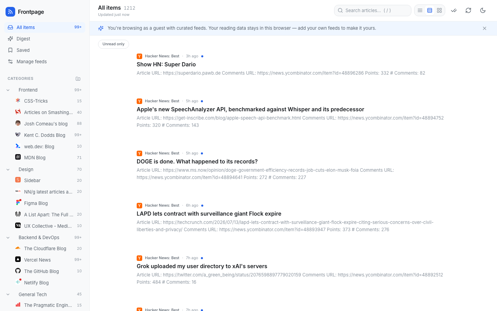

# Frontpage — your personalized front page for tech content

A customizable RSS/Atom content aggregator built for the [Frontend Mentor](https://www.frontendmentor.io) **Frontpage** product challenge. One calm, organized reading dashboard for every blog, newsletter and changelog you follow.



**Links:** [Repository](https://github.com/ZeroCool989/RSS-feed-reader) · Live site: coming soon (Vercel) — try it locally with `npm run dev` and open `/reader?guest=1`

### Built with

- [Next.js 15](https://nextjs.org/) (App Router) + [React 19](https://react.dev/) + [TypeScript](https://www.typescriptlang.org/)
- [Tailwind CSS v4](https://tailwindcss.com/) with the challenge brand-kit tokens
- [Zustand](https://zustand.docs.pmnd.rs/) with `persist` (localStorage)
- [fast-xml-parser](https://github.com/NaturalIntelligence/fast-xml-parser) + [sanitize-html](https://github.com/apostrophecms/sanitize-html) for server-side feed processing
- [Vitest](https://vitest.dev/) + [Playwright](https://playwright.dev/) (86 unit + 30 e2e tests)
- [Lucide](https://lucide.dev/) icons

## Table of contents

- [Overview](#overview)
- [Features](#features)
- [My process](#my-process)
- [Design decisions](#design-decisions)
- [Security](#security)
- [Testing](#testing)
- [Running locally](#running-locally)
- [What I'd do next](#what-id-do-next)

## Overview

Frontpage lets users:

- Add, edit and remove RSS 2.0 / RSS 1.0 (RDF) / Atom 1.0 feed subscriptions, organized into custom categories
- Browse everything in one dashboard with three switchable layouts (compact list, comfortable list, card grid)
- Read full articles in a clean, serif-typeset reader view — or jump to the original source
- Track read/unread state, bookmark articles, and search across all feeds with highlighted matches
- Catch up with a **Digest** view that groups unread stories since the last visit by category
- Import and export subscriptions as OPML (including the sample file's edge cases)
- Drive the whole app from the keyboard: `j`/`k`, `o`, `m`, `s`, `g`-prefixed navigation, `/` for search, `?` for the shortcut reference, and a `⌘K` command palette
- Try everything instantly as a guest with 19 curated feeds across 5 categories

### Architecture path

I built the **frontend-only path** from the spec (`spec/technical-requirements.md`): no auth service or hosted database, with all user data (subscriptions, categories, read state, bookmarks, preferences) persisted client-side. Server-side feed fetching is still real — a Next.js API route fetches, decodes, parses, sanitizes and caches feeds, because CORS makes browser-side fetching impossible and feed HTML must never reach the client unsanitized.

**Stack:** TypeScript · Next.js 15 (App Router) · React 19 · Tailwind CSS v4 (brand-kit tokens) · Zustand (with `persist`) · fast-xml-parser · sanitize-html · Lucide icons

## Features

| Spec feature | Status | Notes |
|---|---|---|
| 1. Feed management | ✅ | Add by URL with validation, rename, recategorize, remove with confirmation, health status (active/stale/error), last-fetch times |
| 2. Feed parsing | ✅ | RSS 2.0, RSS 1.0/RDF, Atom 1.0; charset detection (UTF-8/ISO-8859-1/Windows-1252); entity normalization incl. double-encoding; tolerant date parsing (ISO 8601, RFC 822/2822, zone abbreviations, missing dates); Atom `type="xhtml"` content via a second order-preserving parse; partial recovery of truncated XML |
| 3. Content browsing | ✅ | Title/source/date/excerpt with favicons, reverse-chronological, filter by feed/category, per-feed counts, infinite scroll with intersection observer |
| 4. Category organization | ✅ | Create/rename/delete (feeds fall back to Uncategorized), manual reordering, unread counts in sidebar |
| 5. Read/unread tracking | ✅ | Optimistic mark-on-open, manual toggle, mark-all per feed/category/global with undo toast, persisted, "unread only" filter |
| 6. Article view | ✅ | Sanitized reader view (headings, code, images, tables), metadata header, link to original, next/prev navigation, graceful summary-only fallback |
| 7. Responsive design | ✅ | Sidebar → overlay on mobile, touch-friendly targets, no horizontal scroll (verified in e2e test) |
| 8. Feed error handling | ✅ | Specific error messages (404 vs timeout vs not-a-feed), exponential backoff for failing feeds, per-feed retry, health dashboard, non-blocking refresh |
| 9/10/11. Landing + guest | ✅ | Landing page with dual CTAs; one-click guest mode pre-loaded with the 19 curated feeds; gentle dismissible sign-up nudge |
| 13. Bookmarks | ✅ | Save from list or reader, dedicated Saved view, persisted with full article snapshot |
| 14. Search | ✅ | Debounced-as-you-type across titles/excerpts/authors/sources with term highlighting and helpful empty state |
| 15. OPML import/export | ✅ | Preview with duplicate flagging (both in-file and vs. existing), lowercase attributes, missing `type`, nested outlines flattened, dead feeds reported; export preserves category structure |
| 16. Refresh & polling | ✅ | Refresh all / per feed, configurable interval (manual/15/30/60 min), "N new items" pill, server honors ETag/Last-Modified |
| 17. Performance | ✅ | Server-side feed cache (10 min TTL + conditional revalidation), lazy images, skeleton screens, capped article lists, trimmed localStorage cache for instant second paint |
| 18. Keyboard navigation | ✅ | Full vim-style set + command palette, visual selection indicator, auto scroll-into-view |

## My process

1. Read the full spec, brand kit and sample-data docs first; chose the frontend-only path and mapped every acceptance criterion to a module.
2. Built the server pieces first (parser → sanitizer → SSRF guard → API route) and tested them against all 19 real curated feeds before writing any UI.
3. Built the state store, then the UI shell, then feature views.
4. Verified with an automated Playwright suite driving real Chrome: 15 checks covering guest boot, keyboard nav, reader, bookmarks, digest, search, layouts, palette, dark mode, mobile overlay, onboarding, and the full OPML import flow against the provided sample file (20 unique feeds found, 17 imported, 3 correctly reported as dead/404).

Real-feed testing caught real-world issues an idealized parser would miss: fast-xml-parser's entity-expansion guard rejecting legitimate full-content feeds, Simon Willison's feed shipping full articles in `<summary>` instead of `<content>`, Vercel's Atom feed using structured `type="xhtml"` content (which loses element order in a naive parse), feeds referencing `http://` images that CSP blocks, and two of the curated feeds having genuinely died since the sample data was written (they now demonstrate the error-handling UI in guest mode).

### Reflection

The single hardest problem was Atom's `type="xhtml"` content. My parser flattens XML into plain objects, which silently loses sibling order — so a Vercel article came out as all its paragraphs first, then all its headings. Fixing it meant running a second, order-preserving parse just for those entries and writing a serializer to turn the node tree back into HTML. The lesson that stuck: when a format allows structured markup inside a field, "parse it like data" and "preserve it like a document" are different requirements, and you have to notice which one you actually have. The other lasting takeaway is how much value came from testing against live feeds instead of fixtures — nearly every interesting bug in this project was found by pointing the code at the real world.

## Design decisions

The three design-it-yourself features:

### Content discovery & onboarding

The empty state offers three explicit paths sorted by effort: **curated starter pack** (primary — one click to a full dashboard, same feeds as guest mode), **add a single feed**, or **import OPML** for power users migrating from another reader. The add-feed dialog keeps a permanent **Discover** tab with the curated list grouped by category, so discovery isn't a one-time onboarding event — categories are auto-created when you follow a suggestion. Guest mode *is* the onboarding: you experience a populated product before making any decision.

### Digest view

Visit-based with a 24-hour floor: "what did I miss since I was last here," never less than the last day. One **hero story** (freshest unread with image + excerpt) gets a magazine treatment; the rest are grouped by category, capped at five per category with "+N more" links into the full category view, so a heavy day stays scannable. Quiet days fall back to the most recent unread items ("a quiet stretch — here's the latest") instead of an empty page, and a fully-caught-up state is celebrated rather than apologized for. Each section has its own mark-all-read.

### Layout customization

Three layouts, chosen to cover the real reading modes rather than maximize option count: **compact** (Hacker News-style triage, no images), **comfortable list** (default — excerpt + small thumbnail, the balance of scannability and context), and **card grid** (visual browsing, image-led). Switchable from the toolbar, the command palette, or the `v` key; the preference is global and persisted. Cards degrade gracefully for imageless feeds with a monogram placeholder.

Other choices worth noting:

- **Read ≠ hidden.** Read items de-emphasize (weight/color) but stay in place; hiding is an explicit "Unread only" toggle.
- **Metadata discipline** (from `guidance/patterns.md`): source, time, and unread dot — nothing else in list rows.
- **Dark mode** uses the brand kit's dark palette, follows the system by default, and can be overridden; the choice is applied before first paint to avoid flashing.

## Security

- **SSRF protection** on the feed proxy: http(s)-only, credentials rejected, DNS resolved and checked against private/link-local/CGNAT/metadata ranges (IPv4 + IPv6 incl. mapped forms), redirects followed manually with every hop re-validated, 10 s timeout, 5 MB response cap, rate limiting.
- **XSS protection**: all feed HTML is sanitized server-side (`sanitize-html` allowlist) before the client ever sees it; tracking pixels stripped; links forced to `rel="noopener noreferrer"`; strict CSP, `X-Frame-Options`, `nosniff` headers.
- **XXE-safe parsing**: fast-xml-parser and the browser's `DOMParser` never load DTDs or external entities.

## Testing

Two committed suites — **71 unit tests** (Vitest) and **30 end-to-end tests** (Playwright, driving the locally installed Chrome against a production build with real feeds):

```bash
npm test                     # unit tests (fast, offline)
npm run build && npm run test:e2e   # e2e (needs network — feeds are fetched live)
npm run test:all             # everything
```

- **Unit** (`tests/unit/`): feed parsing across RSS 2.0 / RSS 1.0 / Atom fixtures (entities, CDATA, xhtml element order, truncated-XML recovery), tolerant date parsing, sanitizer XSS vectors, SSRF IP/URL classification (incl. decimal/octal/hex and IPv6-mapped bypass forms), OPML edge cases + export round-trip, and store behavior (dedup, merge-on-refresh, mark-all-read undo, category cleanup) with a mocked API.
- **E2E** (`tests/e2e/`): guest boot, keyboard navigation, reader, bookmarks, digest, search, layouts, command palette, dark mode, manage-feeds CRUD, mobile overlay, onboarding, the full OPML import of the provided sample file (20 found → 17 added → 3 dead reported), OPML export download, and API-level contract tests for SSRF blocking, error classification, caching headers, and server-side sanitization.

Writing the tests caught four real bugs that were then fixed: timezone-less feed dates parsed as server-local time instead of UTC; nav/footer text leaking into sanitized article content; the sanitizer's own `target="_blank"`/`rel="noopener"` transform being stripped by the attribute allowlist; an SSRF bypass via the hex-normalized IPv6-mapped form `[::ffff:7f00:1]`; plus `304 Not Modified` being mishandled as a redirect, and spurious fetch failures under refresh bursts (fixed with a DNS-verdict cache and an upstream-fetch semaphore).

## Running locally

```bash
npm install
npm run dev        # http://localhost:3000
npm run build && npm start   # production
```

No environment variables required. Deploy anywhere Next.js runs (Vercel/Netlify/Render) — the guest experience lives at `/reader?guest=1`.

## What I'd do next

- The full-stack path: move persistence to Postgres + Auth.js so data syncs across devices
- Background refresh via scheduled functions instead of client-triggered fetches
- AI article summaries and a weekly highlights digest (differentiator #1)
- Virtualized list rendering for feeds beyond ~1,000 items
